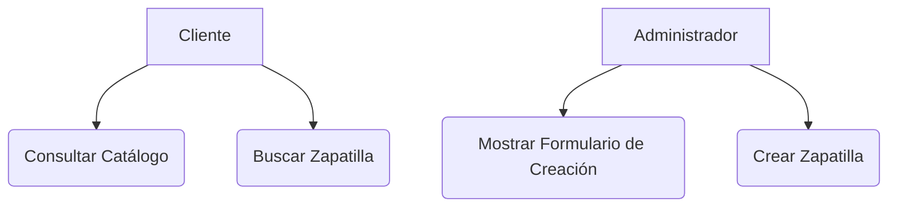
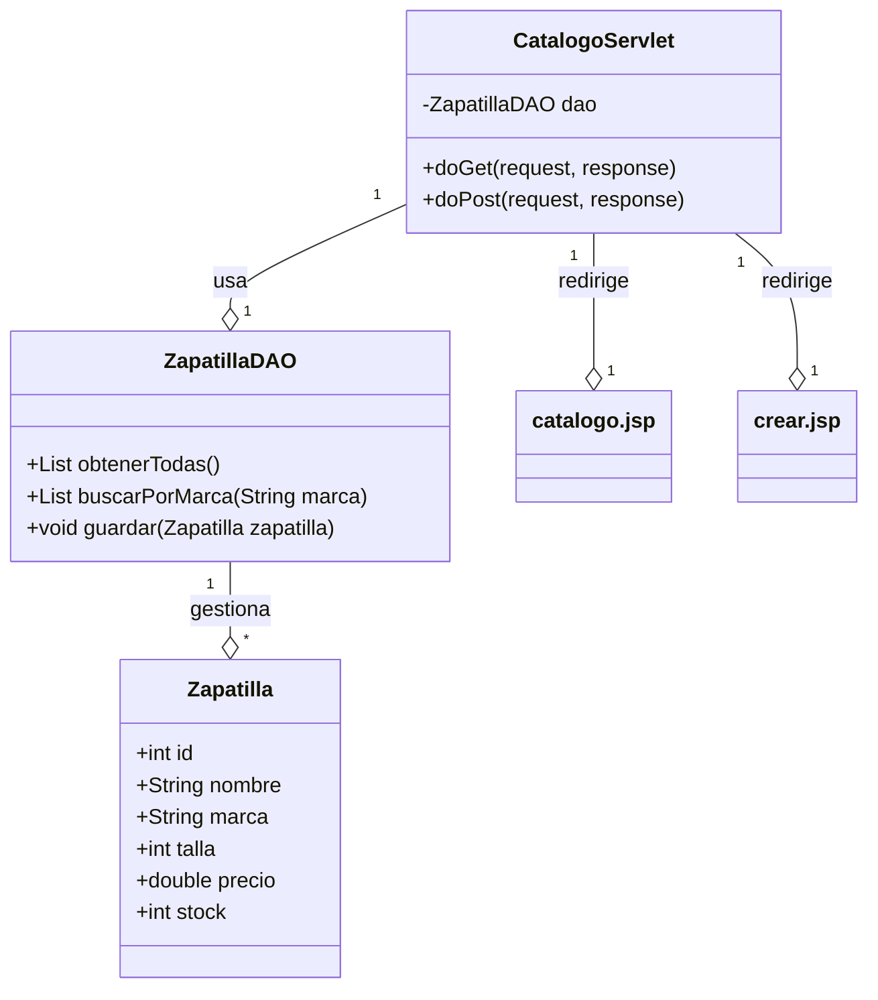

# Artefactos del Ciclo de Desarrollo de Software: Zapatillas J&R - Módulo de Catálogo (Servlets/JSP)

**Proyecto:** Zapatillas J&R - Tienda Online de Zapatillas
**Módulo a Desarrollar:** Gestión y Visualización del Catálogo de Productos (Zapatillas)
**Tecnología Seleccionada:** Web (Servlets, JSP, y Formularios HTML)

---

## 1. Historias de Usuario (User Stories)

Las historias de usuario se mantienen enfocadas en la funcionalidad del catálogo, pero la implementación se realizará con la arquitectura MVC basada en Servlets y JSP.

| ID | Rol | Funcionalidad | Propósito |
| :--- | :--- | :--- | :--- |
| HU-001 | Cliente | Ver un listado de zapatillas en una tabla. | Para poder navegar y seleccionar productos. |
| HU-002 | Cliente | Usar un formulario para buscar zapatillas por marca. | Para acotar mi búsqueda de manera interactiva. |
| HU-003 | Administrador | Acceder a un formulario para agregar una nueva zapatilla. | Para ingresar nuevos productos al sistema. |
| HU-004 | Administrador | Enviar los datos del formulario para guardar la zapatilla. | Para persistir la información del nuevo producto. |

---

## 2. Diagrama de Casos de Uso (Resumen)

El diagrama de casos de uso refleja las interacciones clave con el sistema web, donde los Servlets actúan como controladores y las JSP como vistas.

**Actores:**
*   **Cliente:** Usuario que consulta el catálogo.
*   **Administrador:** Usuario que gestiona el catálogo.

**Casos de Uso:**
1.  **Consultar Catálogo:** Muestra la lista de productos (GET).
2.  **Buscar Zapatilla:** Permite filtrar el catálogo (GET/POST).
3.  **Mostrar Formulario de Creación:** Presenta el formulario HTML (GET).
4.  **Crear Zapatilla:** Procesa el formulario y guarda el producto (POST).

---

## 3. Diagrama de Clases (Modelo de Datos y Lógica)

Este diagrama representa las clases principales del módulo, siguiendo el patrón MVC con Servlets.

| Clase | Tipo | Responsabilidad | Atributos Clave |
| :--- | :--- | :--- | :--- |
| `Zapatilla` | Modelo (POJO) | Representa un producto con sus atributos. | `id`, `nombre`, `marca`, `talla`, `precio`, `stock` |
| `ZapatillaDAO` | Acceso a Datos (DAO) | Maneja la persistencia de datos (simulada o con JDBC). | Métodos CRUD (e.g., `obtenerTodas`, `guardar`). |
| `CatalogoServlet` | Controlador (Servlet) | Recibe peticiones (GET/POST), llama al DAO y redirige a las JSP. | Métodos `doGet`, `doPost`. |
| `catalogo.jsp` | Vista (JSP) | Muestra la lista de zapatillas y el formulario de búsqueda. | Código HTML y etiquetas JSP para iterar la lista. |
| `crear.jsp` | Vista (JSP) | Muestra el formulario HTML para crear una nueva zapatilla. | Formulario HTML con método POST. |

---

## 4. Informe Técnico y Plan de Trabajo

### 4.1. Tecnologías Seleccionadas

| Componente | Tecnología | Versión | Justificación |
| :--- | :--- | :--- | :--- |
| **Backend** | **Java Servlets** | 4.0+ | Actúa como el controlador, manejando las peticiones HTTP (GET y POST). |
| **Frontend/Vista** | **JSP (JavaServer Pages)** | 2.3+ | Utilizado para generar dinámicamente el contenido HTML (la vista). |
| **Lenguaje** | **Java** | 17 | Lenguaje principal del componente formativo. |
| **Persistencia** | **DAO (Data Access Object)** | N/A | Implementación de una capa de acceso a datos simulada (lista en memoria) para simplificar el ejemplo, enfocándose en la lógica de Servlets/JSP. |
| **Build Tool** | **Maven** | Última | Gestión de dependencias y empaquetado del proyecto web (WAR). |

### 4.2. Estándares de Codificación

1.  **Nomenclatura Java:** Uso de *camelCase* para variables y métodos, *PascalCase* para clases.
2.  **Comentarios:** Uso de comentarios Javadoc en las clases Java (`Zapatilla`, `ZapatillaDAO`, `CatalogoServlet`) para explicar su función, parámetros y retorno.
3.  **JSP:** Uso de etiquetas JSTL (JavaServer Pages Standard Tag Library) para la lógica de presentación, separando el código Java de la vista tanto como sea posible.
4.  **Formularios:** Los formularios HTML utilizarán el atributo `method="POST"` para las operaciones de escritura y `method="GET"` para las búsquedas, cumpliendo con el requisito.

### 4.3. Plan de Trabajo (Fases de Codificación)

| Fase | Tarea | Duración Estimada |
| :--- | :--- | :--- |
| **1. Inicialización** | Crear estructura de proyecto Maven Web App y configurar `web.xml`. | 1 hora |
| **2. Modelo y DAO** | Codificar la clase `Zapatilla` (POJO) y la clase `ZapatillaDAO` (simulación de DB). | 1 hora |
| **3. Vistas JSP** | Crear `catalogo.jsp` (lista y búsqueda) y `crear.jsp` (formulario). | 1 hora |
| **4. Controlador Servlet** | Implementar `CatalogoServlet` con `doGet` (listar/buscar) y `doPost` (crear). | 1 hora |
| **5. Versionamiento y Documentación** | Commit del código, creación de `README.md` y preparación de entregables. | 1 hora |

Este plan garantiza la entrega de un módulo funcional con Servlets y JSP, cumpliendo con todos los requisitos de la evidencia AA2_EV02.
